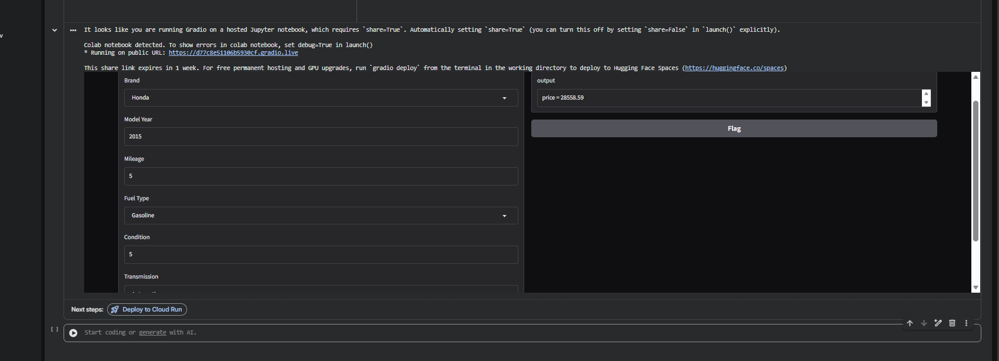

# Used Cars Valuation Model

A supervised regression model to predict used car market valuations based on vehicle specifications and historical sales data.

## Project Structure
- **Code**: `ML_Used_Cars_Valuation_Model (code).ipynb`
- **Dataset / Resources**: `used_cars_powerful.csv`
- **Documentation**: `README.md`

## Output


## Requirements
```bash
pip install pandas numpy scikit-learn matplotlib seaborn jupyter
```

## Usage
1. Clone the repository:
```bash
git clone https://github.com/Yuossef-Ashraf/ML_Used_Cars_Valuation_Model.git
cd ML_Used_Cars_Valuation_Model
```
2. Run the project:
```bash
jupyter notebook "ML_Used_Cars_Valuation_Model (code).ipynb"
```

## Author
Yuossef Ashraf

## License
MIT License
