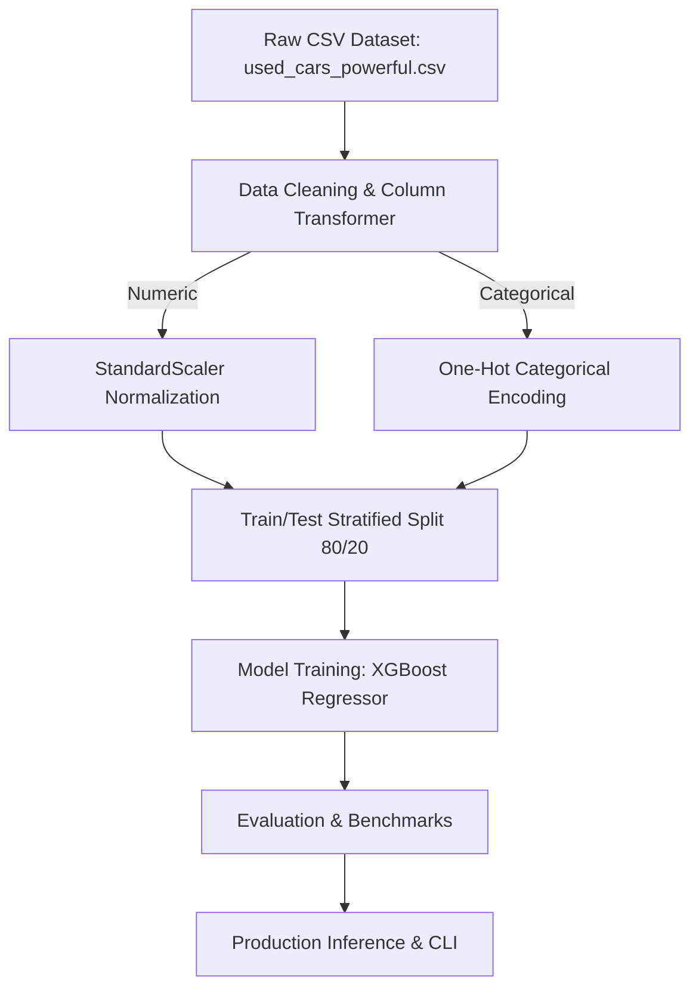

# Automotive Resale Valuation & Used Car Pricing Engine - Architecture & Pipeline Design

## Comparative Models Evaluated
- **XGBoost Regressor**
- **Random Forest Regressor**
- **Gradient Boosting**
- **Linear Regression**
